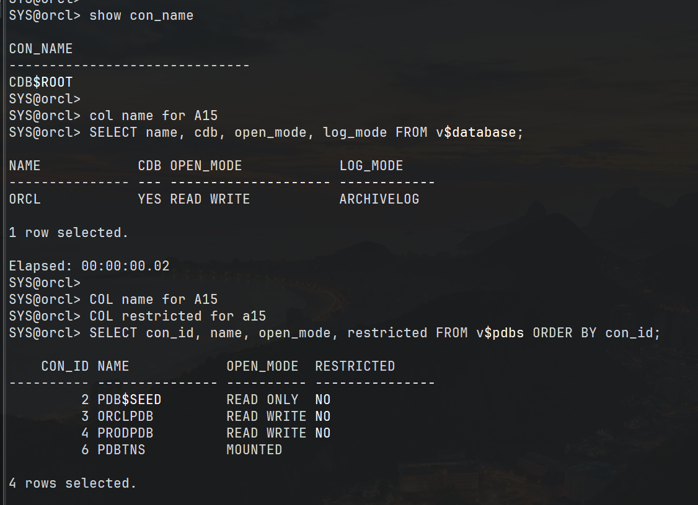

# Oracle Database 19c
# Clone de Pluggable Database (PDB) em Arquitetura Multitenant

---

## Informações do Projeto

| Item | Valor |
|------|-------|
| Projeto | Clone de Pluggable Database |
| Banco de Dados | Oracle Database 19c |
| Arquitetura | Multitenant (CDB/PDB) |
| Sistema Operacional | Oracle Linux |
| Ferramenta | SQL*Plus |
| Autor | Nilton |
| Status | Concluído |

---

# Objetivo

Demonstrar o processo completo de clonagem de uma Pluggable Database (PDB) utilizando Oracle Database 19c em arquitetura Multitenant, validando a integridade da operação, independência física dos datafiles e isolamento lógico dos dados.

Este procedimento é amplamente utilizado para provisionamento de ambientes de desenvolvimento, homologação e testes em ambientes corporativos.

---

# Escopo

O projeto contempla:

- Validação do ambiente Oracle
- Criação de uma nova PDB utilizando Clone Local
- Abertura da nova PDB
- Persistência do estado (SAVE STATE)
- Validação da criação
- Validação dos Datafiles
- Validação do GUID
- Teste de isolamento entre PDBs

---

# Arquitetura

Antes da clonagem:

```
                 CDB ORCL
                     │
      ┌──────────────┴──────────────┐
      │                             │
   ORCLPDB                      PRODPDB
```

Após a clonagem:

```
                 CDB ORCL
                     │
      ┌──────────────┼──────────────┐
      │              │              │
   ORCLPDB        PRODPDB       PDB_CLONE
```

---

# Ambiente

| Componente | Valor |
|------------|-------|
| Oracle Database | 19c |
| Container Database | ORCL |
| PDB Origem | ORCLPDB |
| PDB Clone | PDB_CLONE |
| Open Mode | READ WRITE |
| Log Mode | ARCHIVELOG |

---

# Pré-requisitos

Antes da execução foram verificados:

- Banco em ARCHIVELOG
- Banco aberto em READ WRITE
- Ambiente Multitenant
- Espaço disponível
- PDB origem operacional

Consulta utilizada:

```sql
SELECT
    name,
    cdb,
    open_mode,
    log_mode
FROM v$database;
```

### Evidência

<p align="center">

</p>

---

# Procedimento

## 1. Verificação das PDBs

```sql
SELECT
    con_id,
    name,
    open_mode,
    restricted
FROM v$pdbs
ORDER BY con_id;
```

---

## 2. Criação da Nova PDB

```sql
CREATE PLUGGABLE DATABASE pdb_clone
FROM orclpdb;
```

Resultado esperado

```
Pluggable database created.
```

### Evidência

<p align="center">

</p>

---

## 3. Abertura da PDB

```sql
ALTER PLUGGABLE DATABASE pdb_clone OPEN;
```

---

## 4. Persistência do Estado

```sql
ALTER PLUGGABLE DATABASE pdb_clone SAVE STATE;
```

### Evidência

<p align="center">

</p>

---

# Validação da Criação

Após o clone foi realizada a conferência do GUID da nova PDB.

```sql
SELECT
    con_id,
    name,
    guid,
    open_mode,
    creation_time
FROM v$pdbs
WHERE name IN ('ORCLPDB','PDB_CLONE');
```

Resultado esperado

- GUID diferente
- OPEN READ WRITE
- Nova data de criação

### Evidência

<p align="center">

</p>

---

# Validação dos Datafiles

Foi realizada a comparação entre os datafiles da PDB original e da PDB clonada.

Consulta utilizada:

```sql
SELECT
    c.name,
    d.file_name
FROM cdb_data_files d
JOIN v$containers c
ON c.con_id=d.con_id
WHERE c.name IN ('ORCLPDB','PDB_CLONE');
```

### Evidência

<p align="center">

</p>

---

# Validação da Independência Física

Foi realizada uma comparação direta entre os arquivos físicos.

Resultado

```
No rows selected
```

Conclusão

Os datafiles da PDB original não são compartilhados com a PDB clonada.

### Evidência

<p align="center">

</p>

---

# Teste Funcional

Foi realizado um teste de escrita na PDB clonada.

Novos registros foram inseridos apenas na PDB_CLONE.

Em seguida foi realizada a conferência:

| Ambiente | Registros |
|-----------|----------|
| ORCLPDB | 5 |
| PDB_CLONE | 7 |

Resultado

As alterações permaneceram restritas à PDB clonada, comprovando o isolamento entre os ambientes.

### Evidência

<p align="center">

</p>

---

# Resultado Obtido

O ambiente foi provisionado com sucesso.

Foi validado:

- Clone da PDB
- GUID exclusivo
- Datafiles independentes
- Persistência automática do estado
- Isolamento lógico dos dados
- Integridade da PDB original

---

# Aplicações Corporativas

Este procedimento pode ser utilizado para:

- Provisionamento de ambientes de homologação
- Criação de ambientes de desenvolvimento
- Testes de atualização
- Testes de Backup & Recovery
- Testes de aplicações
- Laboratórios para treinamento
- Ambientes Sandbox

---

# Competências Demonstradas

- Oracle Database 19c
- Oracle Multitenant
- Administração de CDB/PDB
- SQL*Plus
- Oracle Managed Files (OMF)
- Administração de Datafiles
- Administração de Containers
- Provisionamento de Ambientes
- Administração Oracle
- Validação pós-implantação

---

# Estrutura do Repositório

```
oracle-pdb-clone
│
├── README.md
├── script_clone_pdb.sql
│
└── prints
    ├── 01-ambiente.png
    ├── 02-create-pdb.png
    ├── 03-open-save-state.png
    ├── 04-guid.png
    ├── 05-datafiles.png
    ├── 06-comparacao-datafiles.png
    └── 07-isolamento.png
```

---

# Conclusão

Este projeto demonstra uma atividade comum da administração Oracle em ambientes Multitenant, evidenciando a criação de uma Pluggable Database por clonagem, validação da infraestrutura gerada e comprovação do isolamento entre ambientes.

Além da execução dos comandos, foram realizadas validações pós-implantação para garantir a consistência da operação, reproduzindo uma rotina típica de administração de banco de dados em ambientes corporativos.
