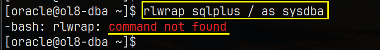
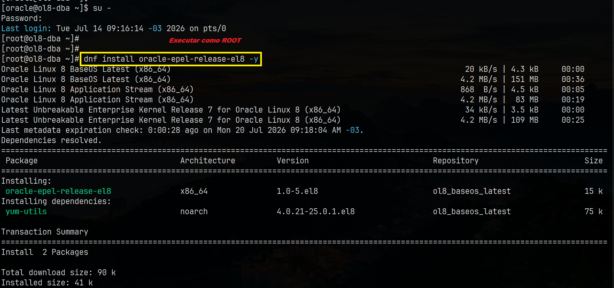
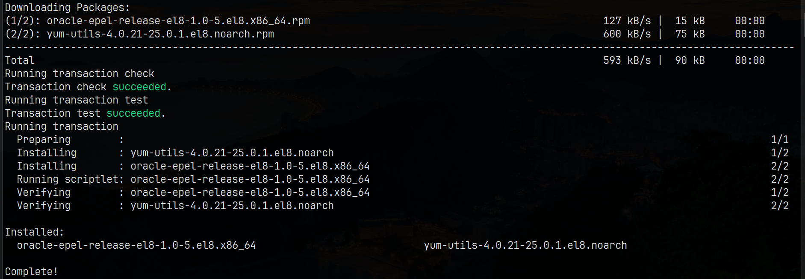
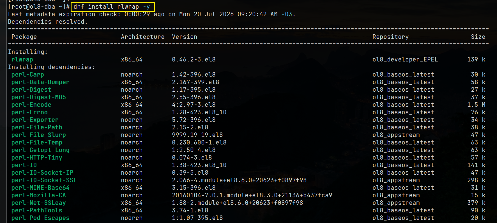
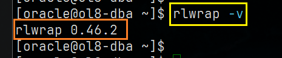
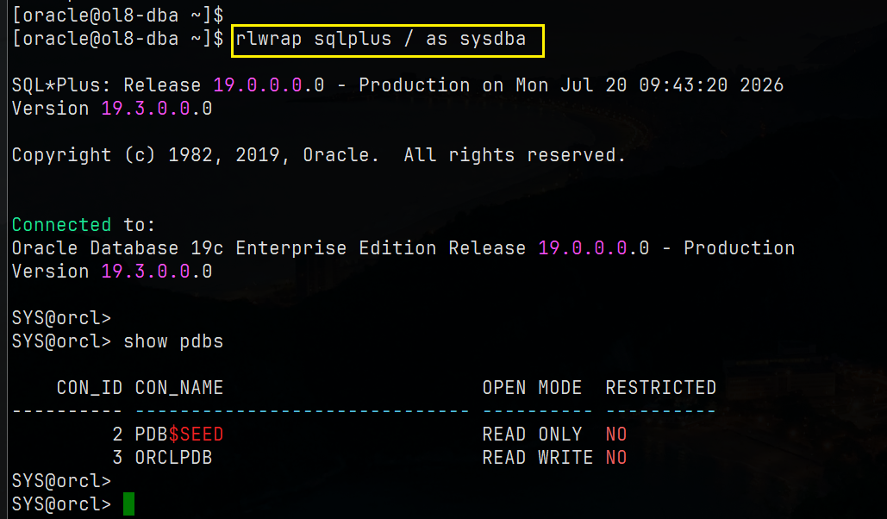
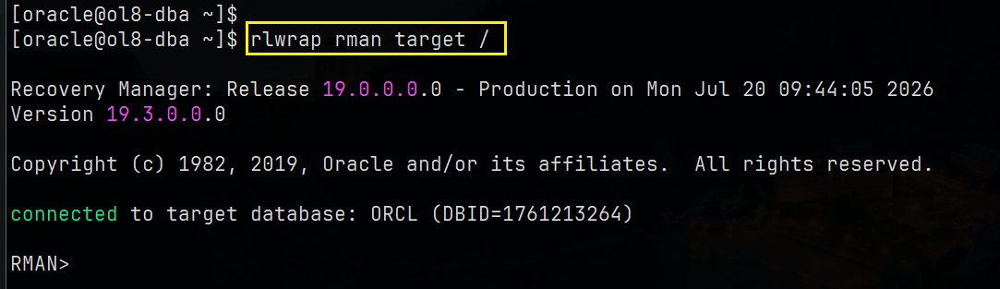
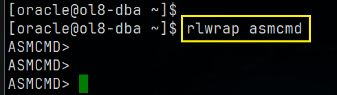

# 🚀 Portfólio DBA Oracle — rlwrap no Oracle Linux 8.10

> **Melhorando a Experiência de Linha de Comando Oracle**  
> Instalação profissional e validação do `rlwrap` para `sqlplus`, `rman` e `asmcmd` no Oracle Linux 8.10.


---
## 📁 Estrutura do Projeto

```
rlwrap/
├── rlwrap_Oracle_8-10.md     # Anotações originais
├── prints/
│   ├── foto1.png             # Erro inicial
│   ├── foto2.jpg             # Início da instalação EPEL
│   ├── foto3.jpg             # EPEL instalado com sucesso
│   ├── foto4.jpg             # Instalação do rlwrap
│   ├── foto5.png             # Verificação da versão
│   ├── foto6.jpg             # Evidência sqlplus
│   ├── foto7.jpg             # Evidência rman
│   └── foto8.png             # Evidência asmcmd
└── install-rlwrap.sh         # Script pronto para uso
```

---

## 📋 Visão Geral

Este projeto documenta o processo completo de habilitação do **repositório EPEL** e instalação do **rlwrap** no **Oracle Linux 8.10**, transformando as ferramentas nativas de linha de comando da Oracle em uma experiência moderna e produtiva no terminal.

### Por que usar o rlwrap?

| Recurso                      | Sem rlwrap              | Com rlwrap                       |
|-----------------------------|-------------------------|----------------------------------|
| Histórico de comandos       | ❌ Nenhum               | ✅ Histórico completo (↑ ↓)      |
| Navegação com setas         | ❌ Quebrada             | ✅ Suporte total                 |
| Autocomplete básico         | ❌ Não                  | ✅ Sim                           |
| Produtividade               | Baixa                   | Alta                             |
| Ideal para                  | Apenas scripts          | Sessões interativas de DBA       |

O **rlwrap** é amplamente utilizado por DBAs Oracle no mundo todo com:
- `sqlplus`
- `rman`
- `asmcmd`
- `adrci`
- `dgmgrl`

---

## 🖥️ Ambiente

| Componente             | Versão / Detalhes                      |
|------------------------|----------------------------------------|
| Sistema Operacional    | Oracle Linux 8.10 (x86_64)             |
| Kernel                 | UEK 7                                  |
| Oracle Database        | 19c Enterprise Edition (19.3.0.0.0)    |
| Usuário                | `oracle` / `root`                      |
| Gerenciador de Pacotes | DNF                                    |
| Versão do rlwrap       | 0.46.2-3.el8                           |

---

## 📸 Evidências — Passo a Passo

### 1. Problema Inicial
O erro clássico que todo DBA Oracle enfrenta ao tentar usar histórico e setas:

```
[oracle@ol8-dba ~]$ rlwrap sqlplus / as sysdba
-bash: rlwrap: command not found
```



---

### 2. Habilitando o Repositório EPEL (como root)

```
# Trocar para root
su -

# Instalar o pacote oracle-epel-release-el8
dnf install oracle-epel-release-el8 -y
```





> **Nota**: Se o comando `dnf config-manager` não existir:
> ```
> dnf install dnf-plugins-core -y
> ```

Habilite o repositório (caso ainda não tenha sido habilitado pelo pacote):

```
dnf config-manager --set-enabled ol8_developer_EPEL
dnf makecache
```

---

### 3. Instalando o rlwrap

```
dnf install rlwrap -y
```



---

### 4. Verificação

```
[oracle@ol8-dba ~]$ rlwrap -v
rlwrap 0.46.2
```



Confirme os repositórios habilitados:

```
dnf repolist | grep -i epel
# Esperado: ol8_developer_EPEL
```

---

### 5. Uso Real em Produção — Evidências

#### 🔹 SQL*Plus com histórico e setas

```
rlwrap sqlplus / as sysdba
```



#### 🔹 RMAN com rlwrap

```
rlwrap rman target /
```



#### 🔹 ASMCMD com rlwrap

```
rlwrap asmcmd
```



---

## ⚡ Script de Instalação Rápida

```bash
#!/bin/bash
# Oracle Linux 8.10 - Instalação do rlwrap (EPEL)
# Autor: Portfólio DBA Oracle
# Compatível com: OL 8.x

set -e

echo ">>> Instalando oracle-epel-release-el8..."
dnf install -y oracle-epel-release-el8

echo ">>> Habilitando ol8_developer_EPEL (se necessário)..."
dnf config-manager --set-enabled ol8_developer_EPEL 2>/dev/null || true

echo ">>> Atualizando cache..."
dnf makecache

echo ">>> Instalando rlwrap..."
dnf install -y rlwrap

echo ">>> Verificação:"
rlwrap -v

echo ""
echo "✅ rlwrap instalado com sucesso!"
echo "Exemplos de uso:"
echo "  rlwrap sqlplus / as sysdba"
echo "  rlwrap rman target /"
echo "  rlwrap asmcmd"
```

---

## 🎯 Aliases Recomendados (adicione no `~/.bashrc`)

```bash
# Ferramentas Oracle com rlwrap
alias sqlplus='rlwrap sqlplus / as sysdba'
alias rman='rlwrap rman target /'
alias asmcmd='rlwrap asmcmd'
alias adrci='rlwrap adrci'
alias dgmgrl='rlwrap dgmgrl'

# Opcional: prompt colorido
export PS1='\[\e[1;32m\][\u@\h \W]\$\[\e[0m\] '
```

Depois recarregue:

```
source ~/.bashrc
```

Agora basta digitar:

```
sqlplus
rman
asmcmd
```

---

## 📚 Benefícios para DBAs Oracle

- **Persistência de histórico** entre sessões (via `~/.sqlplus_history`, etc.)
- Edição completa com **teclas de seta** (esquerda/direita/cima/baixo)
- Busca reversa com **Ctrl+R**
- Melhor experiência de **copiar/colar**
- Melhora drasticamente o trabalho diário interativo com:
  - Sessões de performance tuning
  - Backup & Recovery (RMAN)
  - Administração de ASM
  - Data Guard (dgmgrl)
  - Troubleshooting com adrci

---

## ✍️ Autor

**Portfólio DBA Oracle**  
Especializado em administração de Oracle Database em ambientes Oracle Linux.

---

⭐ **Se este projeto te ajudou, deixe uma estrela!**  
Bons DBAs! 🛢️
